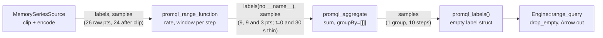

# How `sum(rate(http_requests_total[1m]))` flows

Interactive version with the animated pipeline and Arrow batch inspector: https://thanos-community.github.io/promql-rs/engine-trace.html

promql-engine internals · branch `engine` @ `51d4547`

One query traced end to end: in-memory source → scan → `rate()` → `sum()` → decode, every number engine-verified (see [verification](#verification)).

PromQL compiles to a DataFusion plan over one fixed Arrow shape — one row per series, `labels Struct<name: Utf8View, …>` plus `samples List<Struct<timestamp, value>>`, non-nullable, ascending — which every stage consumes and re-emits, so they stack without a per-stage format.

Timestamps are i64 milliseconds inside the engine, because that is Prometheus's unit and the Arrow `Timestamp(Millisecond)` type. This page quotes them in seconds except where the millisecond is the point.

## The same data, as Arrow sees it

The page carries an animated batch inspector beside the pipeline animation: the same six scenes, drawn as the `RecordBatch` each stage is holding rather than as points on a time axis. It exists to make two things hard to miss. A row's samples are a contiguous run inside one flat child buffer shared by every row, so a range window is a slice between two partition points and not a lookup. And the offsets buffer is the only place the row boundaries live, which is why dropping two samples moves the whole tail of the child array.

Each scene draws:

- **Source.** One batch, three rows. `__name__`, `pod` and `route` as three `Utf8View` columns with one cell per row, then the `samples` column as an offsets buffer `[0, 11, 22, 26]` sitting on two flat child buffers of 26 entries, `timestamp` and `value`, coloured per series. Row 3 is the short one and only the offsets say so.
- **Scan and clip.** The cells at 306 s and 303 s fade, every later cell slides one place left as the child compacts, and the offsets become `[0, 10, 20, 24]`. `__name__` stays: every row carries it and it is the matcher target, so `drop_unused_labels` has nothing to remove — it only drops a column no selected row carries.
- **Rate.** For each row, the contiguous child-buffer range the current window `(t − 60 s, t]` reads is highlighted and labelled with its own two partition points, so at t = 60 s envoy-1 reads `[0, 2)` of its run, envoy-2 `[0, 2)` and envoy-3 `[1, 3)`. Beside it the output batch forms: the same three rows, `labels` now without `__name__`, offsets `[0, 9, 18, 21]`, child cells appearing as steps are produced.
- **Sum.** The accumulator drawn as flat lanes: one row per group, here one, with 11 cells for the `sum` lane, 11 for the Kahan–Neumaier `c` lane and an 11-bit `seen` row. The three input rows land on their lane positions by index — envoy-3 on 1..3, the other two on 2..10 — and the emit then walks the set bits once to produce the output list with offsets `[0, 10]`.
- **Output.** The one-row batch: `labels Struct<>` with zero fields, `samples` offsets `[0, 10]`, ten timestamp and value cells.

Those offsets are the engine's own, read back from `batch.column(1).as_list::<i32>().offsets()` at each stage against `51d4547`: `[0,11,22,26]` from `series::encode`, `[0,10,20,24]` after `series::clip(-59_999, 300_000)`, `[0,9,18,21]` from the `rate` output batch, `[0,10]` from the `sum` output batch.

## 0. Against the Go engine

Every number on this page is the same number Prometheus produces; the reference implementation is the oracle, not the competition. What differs is the shape the work is done in, and that difference is the reason for the Arrow view above.

| | Prometheus, `promql/` | this engine |
|---|---|---|
| data shape | A `Matrix` is a slice of `Series{Metric labels.Labels, Floats []FPoint}` — one Go struct per series, its own label value and its own points slice, and a `Vector` of per-series samples built for each step (the backing slices are pooled and returned). | One `RecordBatch`: one row per series, `labels Struct<name: Utf8View, …>` beside `samples List<Struct<timestamp, value>>`. All 26 samples of all three series live in two flat buffers with four offsets, and a `Utf8View` column stores the repeated metric name once. |
| evaluation order | `rangeEval` in `promql/engine.go` is an outer loop over steps: at each timestamp it evaluates the expression, producing one `Vector` across all series, with the per-series work inside. | Inverted. One pass per row, over a window whose two edges only ever move forward, emitting every step of that series before the next row is touched — which is what lets `rate` carry reset state across steps instead of refolding the window. |
| aggregation state | `map[uint64]*groupedAggregation`, keyed by a hash of the grouping labels, populated again at each step of the range. | Flat lanes indexed `group × steps + step` with a `seen` bitmap, held by one `GroupsAccumulator` for the whole range. A timestamp is an array index, so there is no hash and no per-step rebuild. |
| what crosses between operators | In-memory `Matrix` and `Vector` values, passed between evaluator methods inside one process. | RecordBatches. So DataFusion's partitioning, its partial-state merge across partitions, and execution on another machine are properties of the plan rather than things the engine has to build. |

The arithmetic is deliberately not re-derived: `extrapolated_rate` reproduces `extrapolatedRate` in `promql/functions.go` term for term, including the 1.1× threshold, the half-interval guess and the zero clip, and the aggregation reproduces `kahansum`'s compensation. Section 5 lists where the two diverge on purpose.

What Go does that this does not: native histograms, the full function and operator set (binary and unary operators, subqueries, `topk` and friends), and sorted output. Those are the count in section 5, not a design difference. The columnar shape is not free either — a label struct has to be rebuilt whenever a projection changes the label set, where Go can hand a `labels.Labels` around unchanged.

## 1. Fixture

Three series, each scraped every 30 s on its own phase, so no two land on the same second and only one lands on the step grid.

| series | labels | scrapes at (s) | values |
|---|---|---|---|
| 1 | `pod=envoy-1, route=/` | 6, 36, 66 … 306 (11 pts) | 1, 2, 3, 4, 5, 6, 7, 8, 9, 10, 11 |
| 2 | `pod=envoy-2, route=/` | 3, 33, 63 … 303 (11 pts) | 1, 6, 11, 16, 21, 26, 31, 36, 41, 46, 51 |
| 3 | `pod=envoy-3, route=/api` | 0, 30, 60, 90 (4 pts) | 100, 100, 100, 100 |

The phases are the point: on-grid scrapes hide the interaction between the range window and the step grid, since every window then meets its samples at the same two distances. Series 3 ends at t = 90 s, exercising a series ending mid-query.

**Built by hand, not by the loader.** `from_descriptions` cannot express a phase — it pins value index *i* to timestamp *i × interval*, epoch-anchored, as upstream's `load` does. So each row is a `Series::new(&labels, timestamps, values)` handed to `try_new`, fallible because two series sharing a label set is one series split in two.

**Arrow layout.** Through `from_descriptions`, duplicate label names and lines sharing a label set both collapse last-wins into one `BTreeMap<i64,f64>`; `try_new` rejects the collision instead. Either way on the wire: one `ListArray` (offsets `[0,11,22,26]`) over a shared struct of 26 entries, and `Utf8View` label columns dedupe per batch, so the 20-byte metric name is stored once.

## 2. Query and plan

`RangeQuery::new(0, 300_000, 30_000)` — 0 s to 300 s, step 30 s, the constructor's unit being milliseconds — planned bottom-up, `scan() → call() → aggregate()`:

```
Projection: promql_labels() AS labels, samples
  Aggregate: groupBy=[[]], aggr=[[promql_aggregate(samples, Utf8("sum"), Int64(0), Int64(300000), Int64(30000)) AS samples]]
    Projection: promql_labels(Utf8("pod"), get_field(selector_0.labels, Utf8("pod")), Utf8("route"), get_field(selector_0.labels, Utf8("route"))) AS labels, promql_range_function(selector_0.samples, Utf8("rate"), Int64(0), Int64(300000), Int64(30000), Int64(60000), Int64(0), Int64(NULL)) AS samples
      TableScan: selector_0
```

* **`TableScan: selector_0`** is a `SelectorTable` built eagerly, because a `TableProvider` must know its label-name schema before any scan; named off a per-query counter.
* **Inner `promql_labels(…)`** rebuilds the label struct without `__name__`: `Func::drops_metric_name()` is true for everything but `last_over_time`.
* **`groupBy=[[]]`** from `group_keys(input, [], false) = []`. `sum by (route)` emits `get_field(…) AS __group__route` instead; the prefix stops a label named `labels` or `samples` colliding with engine columns.
* **`SelectHints`**: binding `start_ms`/`end_ms`, advisory `step_ms`, `range_ms = 60_000`, `func = "rate"`. Only `shard` and `grouping` are absent, the latter because the selector's direct parent is `rate`, not the `sum` — upstream's `extractGroupsFromPath` rule.

### The physical plan

What DataFusion makes of it, from `create_physical_plan` on the same session state and `displayable(plan).indent(true)`:

```
ProjectionExec: expr=[{} as labels, samples@0 as samples]
  AggregateExec: mode=Single, gby=[], aggr=[promql_aggregate(samples, sum, 0, 300000, 30000) as samples]
    ProjectionExec: expr=[promql_range_function(samples@1, rate, 0, 300000, 30000, 60000, 0, NULL) as samples]
      DataSourceExec: partitions=1, partition_sizes=[1]
```

* **`DataSourceExec: partitions=1`** is whatever `SelectorTable::scan` handed back. No filter or range shows on the node: the `SelectHints` were consumed at plan time, so the store had already applied them.
* **The lower `ProjectionExec`** is the range kernel as an ordinary scalar UDF over a whole batch. One call covers every row, and each row's entire grid is produced inside it; there is no step loop above this node.
* **The inner `promql_labels(…)` is gone.** Projection pushdown dropped it, since `groupBy=[[]]` reads no label — so `rate`'s label rebuild never runs for this query. The `{}` at the top is the const-folded empty struct that replaced the outer `promql_labels()`.
* **`AggregateExec: mode=Single`**: one input partition and no grouping keys, so neither a repartition nor a two-phase split is needed. `Grouped` sees only `update_batch` and `evaluate`.
* **`sum by (route)` on the same fixture takes the two-phase form**: `mode=Partial`, then `RepartitionExec: partitioning=Hash([__group__route@0], 10), input_partitions=1`, then `mode=FinalPartitioned`. That is where `state()` and `merge_batch` are called, and what crosses the boundary is partial state as a list of `(timestamp, a, b, n, m)` structs.
* **That boundary is the whole distribution story**: partitioned and remote execution are the same path, Arrow partial state in and out, with no engine code that knows which of the two it is. The `10` is `target_partitions`, the core count of the machine that printed this, not a constant of the engine.

## 3a. Selector / scan

`Params::select_range()` gives `lo = start − (window_ms − 1) − offset` and `hi = end − offset`: here **−59.999 s to 300 s**. The odd millisecond is the strict lower bound, in the unit the code counts in — a sample exactly `window_ms` old is never read.

envoy-1's sample at 306 s and envoy-2's at 303 s fall outside; 24 of the 26 reach the kernel. Neither loss shows in the answer, since the last step's window closes at 300 s — move `end` to 330 s and both reappear. The 5-minute lookback plays no part: it applies only to a bare instant selector.

**Matchers and clip.** One `Params` serves the instant selector, the range functions and the aggregation's step count, so `window_ms` is the lookback delta in one and the `[1m]` in the other; there is no separate lookback field. `effective_matchers` synthesizes `__name__="http_requests_total"` from the bare metric name. `MemorySeriesSource::select` compiles matchers as anchored regexes, masks the whole label column, drops the label columns no surviving row carries, then `clip`s to `[-59_999, 300_000]` ms: two `partition_point` searches per row and one `filter` over the shared child, with a batch already inside the range handed straight back.

## 3b. Range selection and `rate`

Kernel is `range_function`; per step *t* the window is `(t − 60 s, t]`. Out of phase with the step grid, each series meets those two edges at its own distance — what `duration_to_start` and `duration_to_end` measure, here no longer 30 s and 0.

### t = 60 s — window (0 s, 60 s]

The first step every series can answer: all three land on factor 2, and no two get there the same way.

| series | window | result | to_start | zero clip | to_end | factor | increase | rate |
|---|---|---|---|---|---|---|---|---|
| envoy-1 | (6 s,1),(36 s,2) | 1 | 6 s (6<33) | 30×(1/1)=30 s, no bite | 24 s (24<33) | (30+6+24)/30 = 2 | 2 | **0.0333333…** |
| envoy-2 | (3 s,1),(33 s,6) | 5 | 3 s | 30×(1/5)=6 s, no bite | 27 s | (30+3+27)/30 = 2 | 10 | **0.1666666…** |
| envoy-3 | (30 s,100),(60 s,100) | 0 | 30 s | `result>0` false, no clip | 0 s | (30+30+0)/30 = 2 | 0 | **0** |

A series scraped 30 s apart is never more than 30 s from either edge of a 60 s window and the two distances always add up to one interval, so the phase moves where the extrapolation happens without changing how much of it there is. Every `[1m]` step from t = 60 s on repeats this table.

**The zero clip does not bite on `[1m]`, and that is the interesting part.** envoy-2 climbs 5 per scrape from 1, so `duration_to_zero = sampled_interval × (first_value / result) = 30×(1/5) = 6` s. The clip only ever shortens `to_start`, which here is 3 s, already inside 6. On the grid it would have asked for 30 s and been cut to 6, changing the answer; the phase is what defuses it.

Widen to `[2m]` and the two guards compose. At t = 60 s envoy-2's first sample is 63 s from the open edge, past the 33 s threshold, so `to_start` becomes the half-interval guess of 15 s — outside the 6 s to zero, so the clip cuts it back to 6. Factor `(30+6+27)/30 = 2.1`, increase 10.5, rate **0.0875**, where the clamp alone gives factor 2.4 and 0.1. The same at t = 90 s; from t = 120 s the window starts inside the series, `to_start` is 3 s, and the clip goes quiet. So the clip only matters once the clamp has already moved the edge — which is why it is applied after it.

**Extrapolation arithmetic, and why `rate` does not refold the window.** `apply` runs `range_function` once per row. `raw_increase` gives `result = last − first`, adding the pre-reset value back at every descending adjacent pair; `extrapolated_rate` takes that and the window's endpoints, with `average = sampled_interval/(n−1)` and `threshold = 1.1×average`. A 5 m window on a 15 s step overlaps its predecessor twenty to one, so refolding per step pays for the same samples twenty times. Two families carry state across the step instead — `Sweep::Counter` for `rate` and `increase`, tracking where the counter reset, and `Sweep::Extremum` for `min_over_time` and `max_over_time`, on a monotone candidate queue — and measured 60–78 % off. The other twelve refold through `evaluate(func, &Window)` on a monotonic `lo`/`hi` pair. Choosing between the two walks is a `match` above the step loop, not a branch inside it, and both are pinned against a fresh-window-per-step oracle and a 400-case fuzz over all fourteen functions.

### t = 30 s — one series answers, sum = 0.0

| series | window (−30 s, 30 s] | n | to_start | to_end | factor | rate |
|---|---|---|---|---|---|---|
| envoy-1 | (6 s,1) | 1 | — | — | — | absent |
| envoy-2 | (3 s,1) | 1 | — | — | — | absent |
| envoy-3 | (0 s,100),(30 s,100) | 2 | 30 s | 0 s | 2 | **0** |

The sum at this step is **0.0 and present** — the clearest case on the page of a zero that is not an absence.

### t = 0 — nothing at all, no output

Window `(−60 s, 0]`: envoy-1's first scrape is at 6 s and envoy-2's at 3 s, so neither has *any* sample in it; envoy-3 has exactly one. Two series miss on emptiness and one on `n == 1` — two rules an on-grid fixture would have collapsed into one.

### t ≥ 120 s — series ending mid-query

envoy-3's window at t = 120 s holds only `(90 s, 100)`; its last contributing step is t = 90 s. `apply` writes results into a fresh `ListArray`, one output row per input row, inheriting the input's null buffer; a null row is skipped and its offsets collapse.

## 3c. Aggregation

`promql_aggregate` is a UDAF whose accumulator is `Grouped`: everything below it already emits at `start + i·step`, so a timestamp *is* an array index and group state is flat lanes over `group × steps + step` plus a `seen` bitmap, not a map per group. A step no series reached stays **absent** rather than zero, which is what the bitmap is for and not something a sentinel value could say. Both ideas sit in the table below: t = 0 absent, t = 30 s a real 0.0.

| step (s) | envoy-1 | envoy-2 | envoy-3 | sum(rate(…[1m])) |
|---|---|---|---|---|
| 0 | absent | absent | absent | **absent** |
| 30 | absent | absent | 0.0 | **0.0** (present) |
| 60 | 0.0333333333 | 0.1666666667 | 0.0 | **0.2** |
| 90 | 0.0333333333 | 0.1666666667 | 0.0 | **0.2** |
| 120 – 300 | 0.0333333333 | 0.1666666667 | absent | **0.2** |

**Grid.** `Grid::new` rejects a non-positive step and caps at `MAX_STEPS = 1_000_000`; here `len = 300 s / 30 s + 1 = 11`. Sum is Kahan–Neumaier per step, with no loop-carried dependency across steps.

**Lanes.** Which lanes an operator wants is decided once, in `Lanes::new` — two for `sum` (`sum`, `c`), three for `avg` and the variances, one for `count`/`min`/`max`, none for `group`, plus a bit lane for `avg`'s "already gone incremental" flag — so growing, dropping an emitted prefix and measuring the state never match on the operator again. Only `min` and `max` fill a fresh position with anything but zero: the NaN the first real value beats.

**Runs.** `Grid::runs` cuts a series' ascending timestamps into maximal runs of consecutive grid positions. Stepping by `step_ms` finds the edges without a division per sample, and only the ends go through `Grid::index`, which is what proves the whole run is on the grid. `add_series` and `merge_batch` share it, so the two cannot drift, and non-ascending timestamps are an execution error rather than a run written at the wrong step. Here envoy-1 and envoy-2 span 2..10, envoy-3 spans 1..3.

**Emit.** `finish` and `partial` walk the group's slice of the bitmap and read the lanes in that same pass: no dense fast path, no gather through an index list, nothing moved out of a lane, and the bitmap materialized once and shared with `release`. All five state children are declared non-nullable, so an unused lane is a buffer of zeros or a `BooleanBuffer::new_unset`, never nulls.

**Merge.** Partial state is read back by name and type-checked, so a peer encoding another version is a query error rather than a worker panic. Merging into a position nothing has reached copies the incoming values verbatim, since merging into a fresh Kahan or Welford state is not bit-identical to a copy. The one-sample-at-a-time `State` enum, restating every operator in upstream's `groupedAggregation` value types, exists only in the test module as the oracle the lane kernels are pinned against.

## 3d. Output

`Grouped::evaluate` emits one canonical `samples` list per group in step order; `is_nullable` is false and a group-less aggregation's `default_value` is an empty list. The top `Projection` builds the empty label set: one row, `labels Struct<>`, `samples` of 10 entries.

`Engine::range_query` hands back `Vec<RecordBatch>`, schema validated once and `series::drop_empty` applied; a caller wanting `Series` calls `series::decode` itself, which re-validates and slices each row zero-copy. **Empty series are dropped in that one step**, deliberately not in the plan, since a plan-side filter could be pushed below the projection and run the kernel twice. Row order is DataFusion's hash-group order; there is no sort.



## 4. Where samples change

Every point that adds, drops, or rewrites a sample, in pipeline order.

| stage | what changes | why |
|---|---|---|
| load | `from_descriptions`: value index → timestamp `i×interval`; `_` (omitted) emits nothing. Not used by this fixture, which needs off-grid timestamps | promqltest `load` semantics |
| load | `from_descriptions`: duplicate lines merged, later value wins a shared timestamp; duplicate label names last-wins | corpus repeats lines on purpose; keeps `encode` from seeing one label set twice |
| load | `try_new`: two ready-built series sharing a label set are rejected rather than merged | one series split in two is a caller bug, caught once instead of per query |
| build | non-ascending timestamps rejected at construction | the whole stack binary-searches them |
| build | labels with `""` value are not stored | `""` is how PromQL spells an absent label |
| scan | `drop_unused_labels` removes label columns no selected row carries | the answer must not depend on what else the store holds |
| scan | `clip(start,end)` drops samples outside the inclusive range: two binary searches per row, then one `filter`. Here it drops the scrapes at 303 s and 306 s | store obligation #1 |
| scan | series lacking a batch label gets synthesized `""` | union schema across rows |
| scan | per-series sample arrays concatenated into one entries array with an offsets buffer | one Arrow list column |
| range | scan window widened by `window_ms−1` ms and shifted by offset; saturating arithmetic | `getTimeRangesForSelector`; clamp an absurd `@`/offset instead of panicking |
| range | StaleNaN samples removed before any arithmetic, once over the whole batch | `matrixIterSlice`: staleness markers are not samples |
| range | per step, samples outside `(range_end−window, range_end]` excluded | half-open window, Prometheus-exact |
| range | counter reset adds back the pre-reset value | `extrapolatedRate` |
| range | `duration_to_start`/`_end` synthesized: clamped to half an average interval past 1.1× threshold | extrapolation to the window edges |
| range | `duration_to_start` clipped so a counter is never extrapolated below zero — after the threshold clamp | `extrapolatedRate` |
| range | a one-sample window yields no sample (rate/increase/delta) | cannot slope from one point |
| range | divide by `window_ms/1000` for `rate` only | rate is per second |
| range | output timestamps are step timestamps, not sample timestamps | alignment to the step grid |
| range | null input row ⇒ null output row; its spanned samples excluded | validity mirrors the input |
| range/labels | `__name__` dropped from the label struct | `dropName` in `evalCall` |
| labels | non-`Utf8View` values cast; NULL → `""` | canonical leaf type, no NULL parents |
| aggregate | timestamp → grid index; off-grid / out-of-range is an execution error | reachable from SQL over any list column |
| aggregate | `Grid::runs` cuts a series into consecutive-position runs; non-ascending timestamps are an error, not a run at the wrong step | one walk for `add_series` and `merge_batch`, so the two cannot drift |
| aggregate | step ≤ 0 and > `MAX_STEPS` rejected, counted in `i128` | an `i64`-wide range is a number to compare, not an overflow |
| aggregate | Kahan–Neumaier compensation added to the sum (two lanes: sum + c) | Prometheus's `kahansum.Inc` |
| aggregate | a merged run splits at the bitmap: reached positions merge, unreached ones copy the incoming state verbatim | merging into a fresh Kahan state is not bit-identical to a copy |
| aggregate | a step no series reached is absent, distinct from a zero sum | `seen` bitmap, not a sentinel |
| aggregate | null rows and `FILTER`ed rows skipped in both `update_batch` and `merge_batch` | absent series, not empty ones |
| plan | `@`, offset and range each bounded to `i64::MAX/4` | three terms meet in one `i64` in `select_range` |
| plan | `range_secs`/`original_offset_secs` floats ×1000, rounded to i64 ms | ms is Prometheus's unit |
| output | series with zero samples dropped from the returned batches | a plan-side filter could be pushed below the projection |
| decode | a NULL label value would read as `""` rather than panic | belt and braces over the non-nullable schema |

## 5. Divergences and TODOs

* **Native histograms are absent** — floats only, and created-timestamp anchoring of a single-sample window is unimplemented, so such a window is always `None`.
* **Only 8 aggregations and 14 range functions** — `topk`/`bottomk`/`quantile`/`count_values`/`limitk`/`limit_ratio`, binary and unary operators, subqueries, scalar literals, and duration-expression ranges/offsets are all unsupported. Every refusal is named, so the untouched remainder is a count per feature rather than "red".
* **The only hint still never filled is `shard`**. `grouping` is filled only for `by`, and only when the aggregation is the selector's direct parent: `without` names what to drop, which tells a store nothing it can act on, and an intervening `rate` means the grouping no longer describes the selector's parent. That is upstream's `extractGroupsFromPath` rule.
* **`@` out of range** is rejected by the planner rather than at parse time as upstream: same outcome, different error site.
* **`MAX_STEPS = 1_000_000`** is this engine's own cap, not Prometheus's 11,000-point API limit.
* **Output ordering is unspecified** — batches come back in DataFusion's hash-group order, while Prometheus's API sorts.
* **Splitting one long series across batches** is explicitly left open.
* **`@` inside a range function** repeats one window's value across every step, but applies `offset` inside the pinned window (`at - offset`), worth a differential check.

### Settled since the last pass

* **Dense group state was researched and rejected.** The idea was to drop the bitmap and emit whole grids: it does not work. A Kahan merge of the positions nothing reached is not a no-op, so the arithmetic would change; and `StateFieldsArgs` carries no operator literal, so the state schema cannot be narrowed to the lanes the operator actually uses. The bitmap stays, and the emit now walks it directly.
* **The promqltest gate is 259 / 259 green.** The 1,044 evals still outside the allowlist are the roadmap, not a regression: each is an `Unsupported` with a feature name, which is what makes the remainder countable.

## Verification

The offset fixture was run against `51d4547` from a throwaway crate outside the repository, depending on `promql-engine` by path, so the working tree was never touched. It built the three series with `Series::new` and `MemorySeriesSource::try_new`, then printed the plan, the per-series `rate` and `increase`, the `sum`, an instant evaluation and a `[2m]` run.

What came back: envoy-1 flat at 0.0333333333 and envoy-2 flat at 0.1666666667, both from t = 60 s through t = 300 s and absent before; envoy-3 at 0.0 for t = 30, 60 and 90 s only; `increase` of 2 and 10 on the same steps. The sum is 0.0 at t = 30 s and 0.2 from t = 60 s on, ten points, with nothing at t = 0. The instant query at 60 s gives the single point `{} 0.2`. The plan printed byte-identical to the one above, which is expected: the label sets did not change, only the timestamps.

Two checks on the reasoning rather than the result. The `[2m]` run exercises both the threshold clamp and the zero clip, neither of which `[1m]` reaches: sum 0.0 at t = 30 s, 0.1066666667 at 60 s, 0.1566666667 at 90 s, then 0.2; per series, envoy-1 goes 0.0191666667, 0.0275, then flat at 0.0333333333, and envoy-2 0.0875, 0.1291666667, then 0.1666666667. Those two envoy-2 values are the clipped ones, and they match the hand arithmetic above to the digit. Moving `end` to 330 s brings back the two scrapes the 300 s scan clipped, with the same `increase` of 2 and 10, confirming they were present in the source and lost only to the clip.
